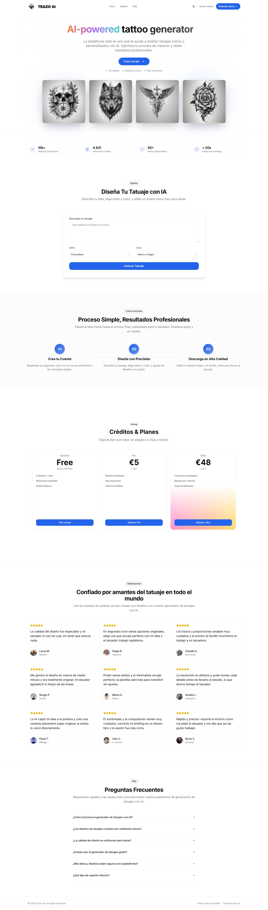
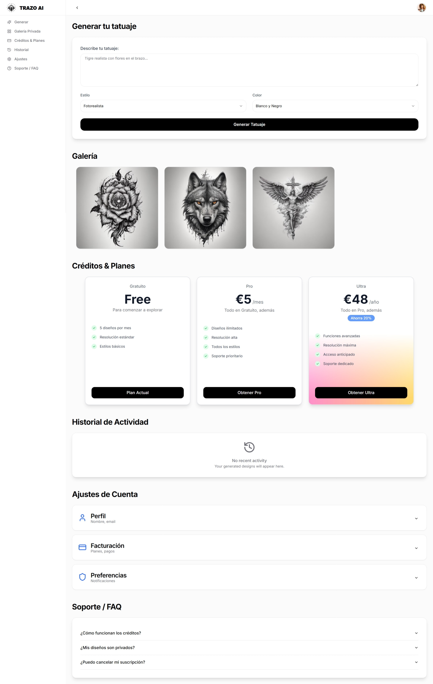

# TrazoAI

Frontend SaaS concept for an AI tattoo generator, with a public landing and an authenticated dashboard experience built in Next.js.

## Demo

[View live demo](https://trazoai.vercel.app/)

## Screenshots

### Landing



### Dashboard



## Stack

- Next.js
- TypeScript
- Tailwind CSS
- Radix UI primitives
- Vitest
- ESLint
- pnpm

## Main areas

- Public landing
- Auth flows
- Generate flow
- Result view
- Private gallery
- Credits and plan UI
- Settings and FAQ
- Public gallery

## Project structure

```txt
app/
components/
hooks/
lib/
public/
scripts/
styles/
tests/api/
types/
Local setup
pnpm install
pnpm dev
Quality checks
pnpm run lint
pnpm run test -- --run
pnpm run build
Production build
pnpm build
pnpm start
Notes

This project is built as a standalone frontend demo with mocked APIs, so it can run and be reviewed without a real backend.
```
